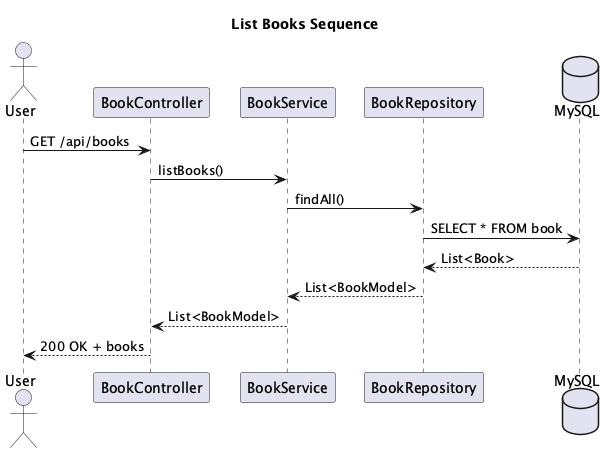

# Book Marketplace

A Spring Boot-based marketplace application for buying and selling books, built with Kotlin.

## 🚀 Quick Start

### Prerequisites
- JDK 17 or higher
- Gradle 8.x
- MySQL 8.x

### Running the Application
```bash
# Clone the repository
git clone <repository-url>

# Navigate to project directory
cd book-marketplace

# Build the project
./gradlew build

# Run the application
./gradlew bootRun
```

## 📚 Documentation

- **Architecture Overview**
  - [PUML Source](docs/architecture.puml)
  - 
- **Database Schema**
  - [PUML Source](docs/database.puml)
  - 
- [API Documentation](docs/api.md)
- [Security Documentation](docs/security.md)
- [Development Guide](docs/development.md)

### Sequence Diagrams (Use Cases)
- **User Registration**  
  [PUML Source](docs/user_registration_sequence.puml)  
  
- **User Login**  
  [PUML Source](docs/user_login_sequence.puml)  
  
- **Book Purchase**  
  [PUML Source](docs/book_purchase_sequence.puml)  
  
- **List Books**  
  [PUML Source](docs/list_books_sequence.puml)  
  
- **Update Book**  
  [PUML Source](docs/update_book_sequence.puml)  
  
- **Delete Book**  
  [PUML Source](docs/delete_book_sequence.puml)  
  
- **Update Customer Profile**  
  [PUML Source](docs/update_customer_profile_sequence.puml)  
  
- **Get Purchase Details**  
  [PUML Source](docs/get_purchase_details_sequence.puml)  
  
- **List Purchases for Customer**  
  [PUML Source](docs/list_purchases_for_customer_sequence.puml)  
  

## 🏗️ Architecture

The application follows a layered architecture pattern:

```
com.bookmarketplace/
├── config/         # Application configuration
├── controller/     # REST API endpoints
├── service/        # Business logic
├── repository/     # Data access
├── model/          # Domain entities
├── security/       # Authentication & authorization
├── validation/     # Input validation
├── events/         # Event handling
├── exception/      # Custom exceptions
├── enums/          # Enumerations
└── extension/      # Kotlin extensions
```

## 🖼️ How to Update UML Diagram Images

If you change any `.puml` file, you must regenerate the corresponding image to keep the documentation up to date:

1. **Install PlantUML** (if not already installed):
   ```sh
   brew install plantuml
   # or
   sdk install plantuml
   # or download plantuml.jar from https://plantuml.com/download
   ```
2. **Generate the PNG image:**
   ```sh
   plantuml -tpng docs/your_diagram.puml
   # Example for all diagrams:
   plantuml -tpng docs/*.puml
   ```
3. **Commit the updated image(s):**
   ```sh
   git add docs/your_diagram.png
   git commit -m "Update UML diagram images"
   git push
   ```
4. **Refresh the README on GitHub** to see the updated diagram.

## 🔑 Key Features

- Book listing and management
- Customer registration and management
- Purchase processing
- JWT-based authentication
- Role-based access control
- Event-driven architecture (Spring @Async, not coroutines)
- Input validation
- Error handling

## 🛠️ Technology Stack

- Kotlin 1.9.x
- Spring Boot 3.x
- MySQL 8.x
- Gradle
- JWT for authentication
- JPA/Hibernate

## 🔒 Security

The application implements:
- JWT-based authentication
- Role-based access control
- Password encryption
- CORS configuration
- Input validation
- SQL injection prevention

## 🧪 Testing

```bash
# Run all tests
./gradlew test

# Run specific test category
./gradlew test --tests "com.bookmarketplace.*.BookServiceTest"
```

## 📦 Build & Deployment

### Building
```bash
./gradlew clean build
```

### Running with Docker
```bash
docker compose up --build
```

## 🤝 Contributing

1. Fork the repository
2. Create your feature branch (`git checkout -b feature/amazing-feature`)
3. Commit your changes (`git commit -m 'Add some amazing feature'`)
4. Push to the branch (`git push origin feature/amazing-feature`)
5. Open a Pull Request

## 📝 License

This project is licensed under the MIT License - see the [LICENSE](LICENSE) file for details.

## 👥 Authors

- Raphael Matori

## 🙏 Acknowledgments

- Spring Boot team
- Kotlin team
- Docker team
- All contributors
